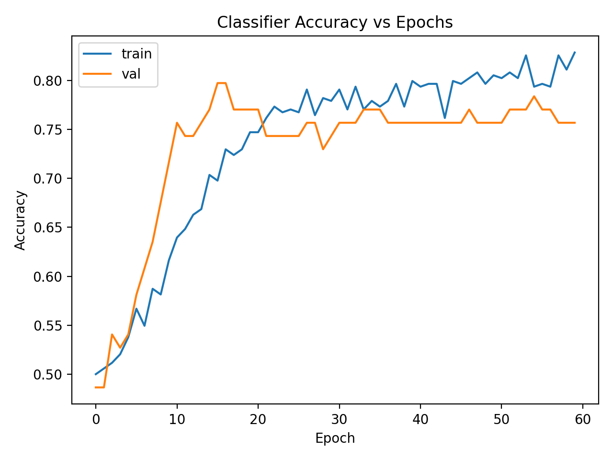
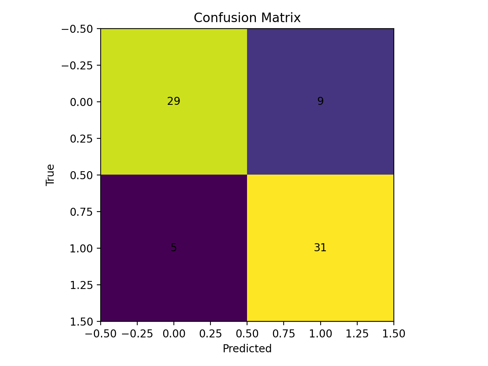
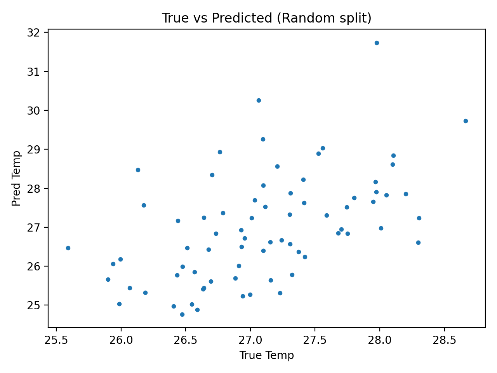
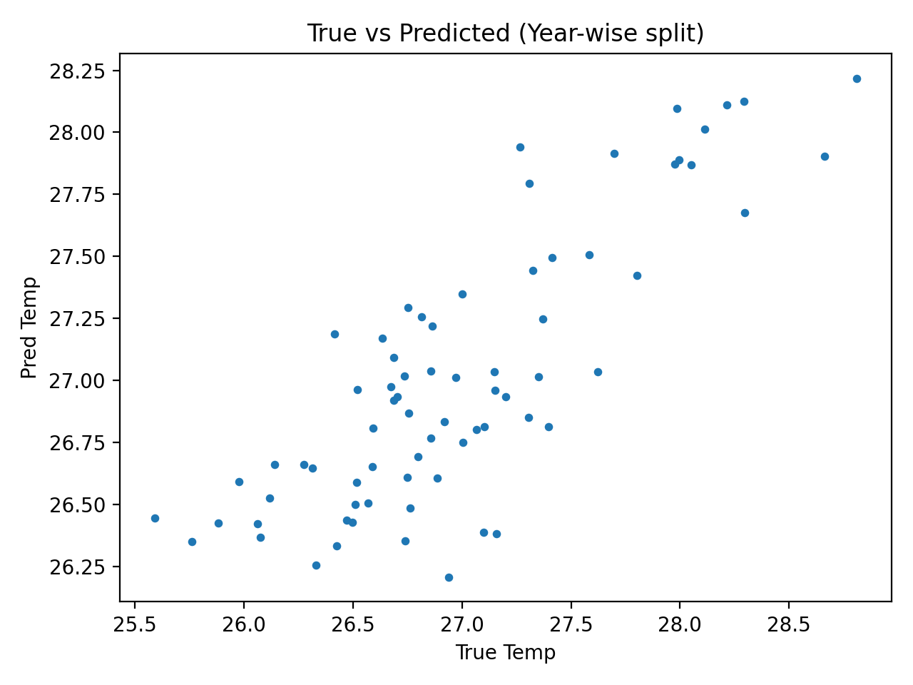

# Amazon Climate Hot-Event Prediction with Neural Networks

This project applies neural network models to long-term climate time-series data to predict:

- **Task A (Classification):** Whether a given month experiences an extreme *hot event*
- **Task B (Regression):** The *monthly temperature value* itself

The workflow emphasises reproducible machine learning, leakage-safe preprocessing, and temporal generalisation testing using a year-wise split.

---

## Project structure

This notebook provides a transparent, end-to-end walkthrough of the data preparation, modelling, and evaluation steps.

Reusable training and evaluation logic is implemented as modular Python scripts inside the `src/` directory.

- Train models: `python -m src.train_all`
- Evaluate models: `python -m src.evaluate_all`
```bash
amazon-climate-neural-networks/
│
├── notebooks/
│ └── climate_neural_networks.ipynb
│
├── src/
│ ├── data.py
│ ├── features.py
│ ├── splitting.py
│ ├── models.py
│ ├── plotting.py
│ ├── train_all.py
│ └── evaluate_all.py
│
├── figures/ # Generated plots (selected outputs committed)
├── models/ # Trained models and scalers (generated, not committed)
├── data/ # Input CSV files (not committed)
│
├── requirements.txt
├── .gitignore
└── README.md

```
---

## Data overview

The dataset consists of monthly observations spanning multiple decades and includes:

- Historical temperature measurements for a defined Amazonian region
- Large-scale climate indices:
  - ENSO
  - NAO
  - TSA
  - TNA

A month is labelled as a **hot event** if its temperature exceeds a month-specific threshold.

> Raw data files are intentionally excluded from this repository.

---

## Feature engineering & preprocessing

Key preprocessing steps include:

- Cyclic encoding of the month feature using sine and cosine transforms
- Feature standardisation using training-set statistics only
- Explicit prevention of data leakage across train/validation/test splits

All random processes are controlled via a fixed random seed for reproducibility.

---

## Models

### Classification (Task A)
- Feedforward neural network
- Binary cross-entropy loss
- Evaluation metrics:
  - Confusion matrix
  - Balanced accuracy
  - Sensitivity (TPR) and specificity (TNR)

### Regression (Task B)

Two regression settings are evaluated:

1. **Random split regression**
   - Predicts monthly temperature
   - Target values are not scaled

2. **Year-wise split regression**
   - Entire calendar years are isolated across splits
   - Target values are scaled using a separate target scaler
   - Tests temporal generalisation rather than interpolation

All models are serialised alongside their associated scalers.

---

## Results
### Classification — Hot event detection

**Accuracy vs Epochs (Train / Validation)**  


**Confusion Matrix (Test Split)**  

```
---

### Regression — Temperature prediction

**Random Split: True vs Predicted**  


**Year-wise Split: True vs Predicted (Temporal Generalisation)**  


---

## Reproducibility

This project follows best practices for reproducible machine learning:

- Fixed random seeds
- Train-only fitting of all scalers
- Clear separation of feature and target scaling
- Serialised models and preprocessing artifacts
- Deterministic evaluation scripts

---

## Tech stack

- Python
- NumPy, Pandas
- Scikit-learn
- TensorFlow / Keras
- Matplotlib

---

## Author

**Hrithik Jadhav**  
Master of Information Technology (Artificial Intelligence)

---

## Notes

This project is adapted from an academic exercise and has been refactored and structured for portfolio and professional demonstration purposes. All implementation and analysis are my own.
